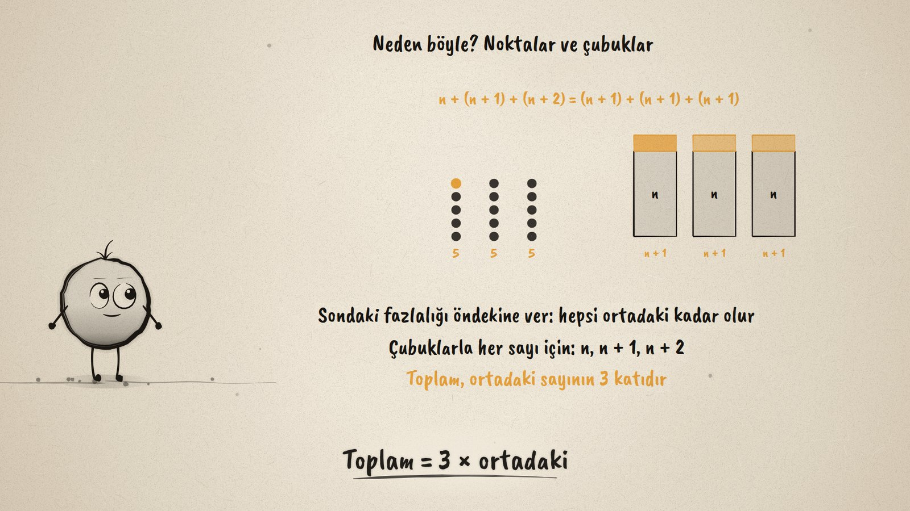
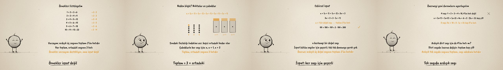

# Hep Böyle mi? · Reasoning and Proof with Numbers

**▶ Tarayıcıda izleyin / Watch in the browser:** https://hakanatas.github.io/hep-boyle-mi/ 
**⬇ MP4 + altyazılar / MP4 + subtitles:** [Releases](https://github.com/hakanatas/hep-boyle-mi/releases) 
**✎ Kullanılan istem / The prompt behind it:** [PROMPT.md](PROMPT.md) 
**🎞 Bütün filmler / All films:** [Nokta'nın Filmleri](https://hakanatas.github.io/nokta-filmleri/?sinif=7)

> **TR —** 7. sınıf matematik "İşlemlerle Cebirsel Düşünme ve Değişimler" temasındaki MAT.7.2.3 öğrenme çıktısı için hazırlanmış, tamamen JavaScript ile çizilen 92 saniyelik mürekkep animasyonu. Ece iki örnek buluyor: 4 + 5 + 6 = 15 ve 7 + 8 + 9 = 24, ikisi de 3'ün katı. Varsayım: ardışık üç sayının toplamı hep 3'ün katıdır. Örnekler listeleniyor (6, 9, 12, 15, 18, 33) ve her toplamın ortadaki sayının 3 katı olduğu görülüyor; ama örnekler ispat değil. Noktalarla ve n, n + 1, n + 2 çubuklarıyla sondaki fazlalık öndekine verilince hepsi ortadaki kadar oluyor. Cebirsel ispat: n + (n + 1) + (n + 2) = 3n + 3 = 3 · (n + 1); önerme her sayı için geçerli (99 + 100 + 101 = 300). Son olarak önerme uyarlanıyor: ardışık dört sayının toplamı 4'ün katı değil ama hep çift (2 · (2n + 3)), ardışık beş sayının toplamı 5'in katı (5 · (n + 2)). Altyazılar Türkçe, İngilizce ya da ikisi birlikte seçilebilir.

A 92-second ink animation for **7th-grade maths**. Nokta, the ink character from [The Learning Ink](https://github.com/hakanatas/the-learning-ink), is the guide again. The same move is shown twice (`dots` and `bars` in `scenes/scene1.js`): one dot, then one unit square, jumps from the last column to the first, first for 4, 5, 6 and then for any n, which is the idea the algebraic proof writes down.

## Learning outcome

MEB, Türkiye Yüzyılı Maarif Modeli, Ortaokul Matematik, 7th grade, "İşlemlerle Cebirsel Düşünme ve Değişimler" theme:

**MAT.7.2.3. Sayılar ve özelliklerini içeren ispatlara ilişkin matematiksel muhakeme yapabilme**
- a) Sayılar ve özellikleriyle ilgili ilişkilere yönelik örneklere ve örüntülere dayalı varsayımlarda bulunur.
- b) Varsayımına yönelik sayı örüntülerini listeler.
- c) Elde ettiği örüntülerin, varsayımını karşılayıp karşılamadığını sınar.
- ç) Ulaştığı sonuca yönelik doğrulayabileceği matematiksel bir önermeyi sözel veya cebirsel olarak ifade eder.
- d) Sunduğu önermenin katkısına yönelik gerekçeler sunar.
- e) Sayılar ve özelliklerine ilişkin durumlarda cebirsel ispat yöntemlerini seçerek işe koşar.
- f) Önermeyi gözden geçirerek yeni durumlara uyarlar.

## Scenes

| # | Time | Scene | What happens | Outcome |
|---|---|---|---|---|
| 1 | 0–10 s | Bir varsayım | 4 + 5 + 6 = 15, 7 + 8 + 9 = 24: always a multiple of 3? | a |
| 2 | 10–28 s | Örüntü | Six sums listed, each 3 × the middle number; examples are not a proof. | a, b, c |
| 3 | 28–46 s | Neden? | Dots and bars even out: the sum is 3 × the middle number. | c, ç |
| 4 | 46–64 s | İspat | n + (n + 1) + (n + 2) = 3(n + 1); 99 + 100 + 101 = 300. | ç, d, e |
| 5 | 64–80 s | Uyarlama | Four numbers: not a multiple of 4 but always even; five numbers: a multiple of 5. | f |
| 6 | 80–92 s | Aklında kalsın | Guess, test, prove. | a–f |

## Running it

- **Preview:** double-click `index.html` (it works offline).
- **MP4:** run `npm install` once, then `npm run export -- --format=horizontal --captions=tr`.
- **Subtitles and narration:** `npm run srt` writes `out/captions_*.srt` and `narration_notes.txt`.
- **Editing:**
  - Caption text, timings and narration notes: `captions.js`
  - Everything on screen is drawn by `LI.world(t)` in `scenes/scene1.js` (the list, the dots, the bars, the proof, the words); the other scenes only set the camera.
  - Nokta's poses: `src/draw/film.js`; layout for 16:9 and 9:16: `src/draw/kd.js`

It uses the same engine as The Learning Ink: `renderFrame(t)` as a pure function of time, seeded randomness, and frame-by-frame export.

## Lisans · License

**TR —** Bu film ve kodu [Creative Commons Atıf-GayriTicari 4.0 Uluslararası (CC BY-NC 4.0)](https://creativecommons.org/licenses/by-nc/4.0/deed.tr) lisansıyla paylaşılır. Ticari olmayan her amaçla (derste, okulda, eğitim materyalinde) kopyalayabilir, paylaşabilir ve değiştirebilirsiniz; ancak **kaynak göstermek zorunludur**: eser sahibinin adı ve bu deponun bağlantısı belirtilmeden kullanılamaz. Ticari kullanım (satış, ücretli ürün ya da yayın) için izin alınmalıdır.

**EN —** This film and its code are licensed under [Creative Commons Attribution-NonCommercial 4.0 International (CC BY-NC 4.0)](https://creativecommons.org/licenses/by-nc/4.0/). You may copy, share and adapt them for non-commercial purposes, but **attribution is required**: they may not be used without crediting the author and linking to this repository. Commercial use requires permission.

Atıf örneği / Required credit: *“Hep Böyle mi?”, Hakan Ataş, Nokta'nın Filmleri — https://github.com/hakanatas/hep-boyle-mi — CC BY-NC 4.0*
